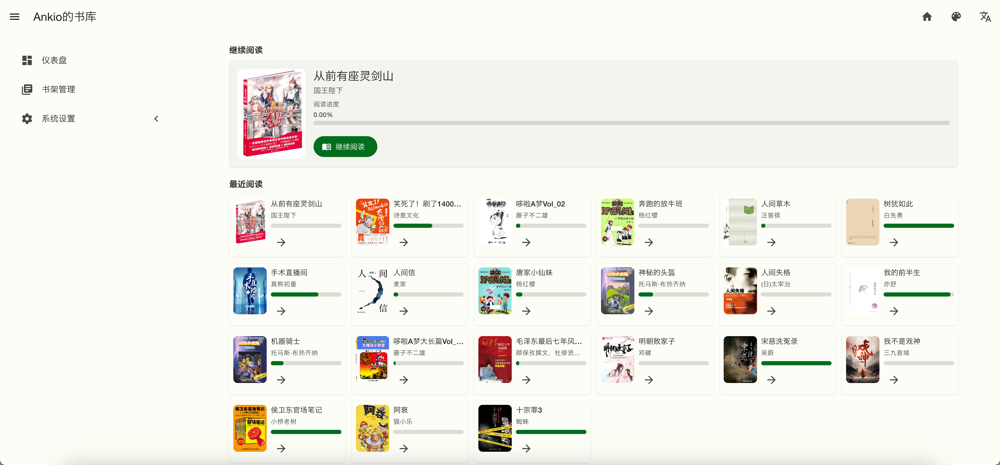

# Book 书籍管理系统

> **基于静读天下 App WebDAV 同步的 Web 端书库管理系统**

一个为 **静读天下（Moon+ Reader）** 用户设计的 PC 端书库管理后台：手机 App 通过 WebDAV 同步书籍和元数据，本系统在 Web 端提供更顺手的搜索、批量编辑、豆瓣抓取、阅读器等能力，并把改动同步回 WebDAV，形成双向闭环。

---

## ⚠️ 使用前必读

本系统**不是独立的书库管理系统**，必须配合静读天下 App + WebDAV 一起使用：

1. 在手机上安装静读天下（Moon+ Reader）
2. 配置一个可用的 WebDAV 服务（坚果云 / Nextcloud / 群晖 等）
3. 在静读天下中至少完成一次同步，让 WebDAV 上出现 `Apps/Books/` 目录
4. 把**完全相同**的 WebDAV 凭据填入本系统的 `config.php`

没有静读天下生成的 WebDAV 数据，本系统是空的。

---

## 功能概览

- WebDAV 双向同步：与静读天下共享同一个书库
- 元数据管理：分类、收藏、系列（带编号）、5 星评分
- 豆瓣自动抓取：书名、作者、简介、封面、出版信息
- 批量操作：批量改分类 / 收藏 / 系列、批量删除、批量刮削封面、删除重复
- Web 端上传：拖拽 / 多选，大文件分片（2MB），上传后自动入库并发布到 WebDAV
- 在线阅读器（Foliate.js）：支持 EPUB / MOBI / AZW / AZW3 / PDF
- 阅读进度同步：与静读天下共享同一份进度文件

---

## 界面预览

<p align="center">
  <br/>
  <sub><b>仪表盘</b> — 继续阅读卡片 + 最近阅读列表，一眼回到上次的位置</sub>
</p>

<p align="center">
  <br/>
  <sub><b>书架管理</b> — 多维度筛选（书名/作者、系列、收藏、已读）与批量操作</sub>
</p>

---

## 系统要求

| 组件 | 版本 / 说明 |
| --- | --- |
| PHP | ≥ 8.3，需要 `mbstring`、`pdo_mysql`、`curl`、`gd`、`zip`、`fileinfo` |
| MySQL / MariaDB | MySQL ≥ 5.7 或 MariaDB ≥ 10.2，字符集 `utf8mb4` |
| Web 服务器 | Nginx 或 Apache（必须支持 URL 重写） |
| WebDAV | 坚果云 / Nextcloud / 群晖 / 阿里云盘网关，任选其一 |
| 静读天下 App | Android，支持 WebDAV 同步的版本即可 |
| Docker（可选） | 仅当需要 MOBI/AZW 格式转换、Calibre 元数据时使用 |

---

## 需要起哪些容器（部署形态）

本系统是一个普通 PHP 项目，**核心服务不强制 Docker**，但配套依赖建议容器化：

### 必需

| 服务 | 用途 | 推荐镜像 |
| --- | --- | --- |
| MySQL / MariaDB | 业务数据库 | `mysql:8.0` 或 `mariadb:11` |
| PHP-FPM | 运行 PHP 8.3 | `php:8.3-fpm` |
| Nginx | 静态资源 + 反向代理到 PHP-FPM | `nginx:alpine` |

> 如果用 1Panel / 宝塔 / Laradock / Docker Compose 直接装现成 LNMP 也可以，本质就是一个 PHP 8.3 + MySQL 的环境。

### 可选

- **`ebook-service` 容器**：位于 `src/calibre/ebook-service/`，封装 Calibre CLI 提供 HTTP 接口，用于：
  - MOBI / AZW / AZW3 ↔ EPUB 等格式转换
  - 非 EPUB 文件的封面提取与元数据读取

  启动方式：

  ```bash
  cd src/calibre/ebook-service
  docker compose up -d
  ```

  服务监听 `8080` 端口，然后在 `src/config.php` 中配置：

  ```php
  'calibre' => 'http://localhost:8080',
  ```

  不需要 Calibre 能力时，**这个容器可以完全不装**，系统只会失去格式转换功能。

---

## 安装步骤

### 1. 拉代码

```bash
git clone <repository-url> book
cd book
git submodule update --init --recursive
```

### 2. 创建数据库

登录 MySQL，建一个空库 + 一个专用账号：

```sql
CREATE DATABASE `book` DEFAULT CHARACTER SET utf8mb4 COLLATE utf8mb4_unicode_ci;
CREATE USER 'book'@'%' IDENTIFIED BY '改成你自己的强密码';
GRANT ALL PRIVILEGES ON `book`.* TO 'book'@'%';
FLUSH PRIVILEGES;
```

> 不需要手工建表，应用首次启动会自动建表并升级 schema（见 `BookModel::getUpgradeSql()`）。

### 3. 配置 `src/config.php`

复制 / 编辑这份配置（生产环境务必关闭 debug）：

```php
<?php
return [
    'debug'    => false,
    'timezone' => 'Asia/Shanghai',
    'domain'   => ['your-domain.com'],   // 允许访问的域名/IP

    // —— 数据库 ——
    'db' => [
        'host'     => '127.0.0.1',       // 容器内可填容器名，如 mysql
        'type'     => 'mysql',
        'port'     => 3306,
        'username' => 'book',
        'password' => '上一步设置的密码',
        'db'       => 'book',
        'charset'  => 'utf8mb4',
    ],

    // —— WebDAV（必填，要和静读天下完全一致）——
    'webdav' => [
        'deviceId' => 'web_manager_001',                  // 任意不重复字符串
        'url'      => 'https://dav.jianguoyun.com/dav/',  // 坚果云示例
        'username' => 'your_email@example.com',
        'password' => '坚果云应用密码（不是登录密码）',
    ],

    // —— 登录 / 系统 ——
    'login' => [
        'allowedLoginCount' => 1,        // 同账号最大在线数
        'loginCallback'     => '/',
        'systemName'        => '我的书库',
        'ssoEnable'         => false,    // 不用 SSO 就关掉
    ],

    // —— 可选：Calibre 微服务 ——
    'calibre' => 'http://localhost:8080',
];
```

⚠️ 三个最常见的 WebDAV 配错：
- 地址少了末尾 `/dav/`
- 坚果云填了登录密码而不是“应用密码”
- App 端和本系统 `username/url` 不一致

### 4. 配置 Nginx

工作目录指向 `src/public`，并加 URL 重写：

```nginx
server {
    listen 80;
    server_name your-domain.com;
    root /path/to/book/src/public;
    index index.php;

    location / {
        rewrite ^(.*)$ /index.php/$1 last;
    }

    location ~ \.php(/|$) {
        fastcgi_split_path_info ^(.+\.php)(/.*)$;
        fastcgi_pass   127.0.0.1:9000;   # 容器化部署改成 php-fpm:9000
        fastcgi_index  index.php;
        include        fastcgi_params;
        fastcgi_param  SCRIPT_FILENAME $document_root$fastcgi_script_name;
        fastcgi_param  PATH_INFO       $fastcgi_path_info;
    }
}
```

确保 `src/runtime` 目录对 PHP 进程可写（缓存、日志、首次管理员密码都写这里）。

### 5. 首次访问

打开 `http://your-domain.com`，会被重定向到登录页。

---

## 用户名密码在哪里设置？

本系统**没有注册页**，账号是首次启动时自动生成的：

1. 第一次访问触发数据库建表，`UserDao::onCreateTable()` 会创建一个超级管理员：
   - 用户名固定：`admin`
   - 密码：随机 16 位十六进制串
2. 这个初始密码会写到两个地方：
   - 应用日志（`Logger::info`）
   - **文件 `src/runtime/admin_password.txt`**

获取初始密码：

```bash
cat src/runtime/admin_password.txt
# 输出形如：初始管理员账户创建成功，账户: admin，密码: 8f3c9a1b6d2e4a07
```

登录后立刻去**右上角用户菜单 → 修改密码**，把初始随机密码换成你自己的。底层走的是 `/login/reset`，限制：
- 新密码最少 8 位
- 新用户名只能是 `5–10` 位的小写字母数字
- 修改成功会强制踢下线，需要用新凭据重新登录

> 删除 `src/runtime/admin_password.txt` 没问题，密码已经入库。但如果你忘了密码、又没保存这个文件，最快的做法是直接 `DROP TABLE` 用户相关表（让系统重新生成 admin），或者手动用 `password_hash()` 在 MySQL 里改 `password` 字段。

如果你有自建 SSO（OIDC），把 `login.ssoEnable` 改成 `true`，再填 `ssoProviderUrl / ssoClientId / ssoClientSecret` 即可，密码登录会自动跳过。

---

## 静读天下侧配置（一次就够）

打开静读天下 App → 设置 → 通过 WebDAV 同步：

```
服务器地址 : https://dav.jianguoyun.com/dav/    （以坚果云为例）
用户名     : your_email@example.com
密码       : 应用密码（不是登录密码）
同步文件夹 : Apps/Books/                        （保持默认，不要改）
勾选【同步我的书架】
```

在 App 侧执行一次「立即同步」，确认 WebDAV 上出现 `Apps/Books/` 目录后，再回到本系统点右上角「同步」按钮拉数据。

---

## 典型工作流

```
手机静读天下 → 加书 / 改元数据 → 同步到 WebDAV
                                      │
                                      ▼
                          本系统点击「同步」按钮
                                      │
                                      ▼
                       Web 端搜索 / 批量编辑 / 豆瓣抓取
                                      │
                                      ▼
                         手机静读天下下次同步拉走更新
```

---

## 故障排查

**同步后没有任何书：**
- 确认手机端真的成功同步了（WebDAV 上有 `Apps/Books/<书名>.epub`）
- 用 curl 验证 WebDAV 凭据：`curl -u "user:pass" https://dav.jianguoyun.com/dav/Apps/Books/`
- 检查 `src/runtime/log/` 下的错误日志

**登录页一直 403：**
- 验证码识别有误，刷新一下
- 看 `src/runtime/log/` 是否记录了「密码错误 / 验证码错误」

**封面 / 格式转换报错：**
- 没起 `ebook-service` 容器；EPUB 不依赖它，其他格式必须有
- 在容器里 `curl http://localhost:8080/health` 自检

**数据库连不上：**
- Docker 部署时 `db.host` 必须是容器名（如 `mysql`），不能写 `localhost`
- 确认账号有 `book` 库的全部权限

---

## 目录结构

```
book/
├── src/
│   ├── app/                # 业务代码（controller / database / utils / view）
│   ├── nova/               # Nova 框架 + 插件（submodule）
│   ├── public/             # Web 入口，Nginx root 指向这里
│   ├── runtime/            # 缓存、日志、admin_password.txt
│   ├── calibre/
│   │   └── ebook-service/  # 可选 Calibre 微服务（docker compose）
│   └── config.php          # 全部配置都在这一个文件
├── nginx.conf              # 仅包含一行 rewrite，作为参考
├── nova.phar               # CLI 工具
└── README.md
```

---

## 技术栈

- 后端：PHP 8.3 + Nova 框架 + MySQL
- 前端：MDUI 2.x + jQuery + Foliate.js（在线阅读器）
- 存储：WebDAV（坚果云 / Nextcloud / 群晖 ……）
- 可选：Calibre（封装在 `ebook-service` Python 微服务里）

---

## 许可证

MIT License

## 贡献

欢迎 Issue / PR：
- PHP：PSR-12 / `php-cs-fixer.dist.php`
- JS：ES6+
- Commit：写清楚“为什么改”，不只是“改了什么”
