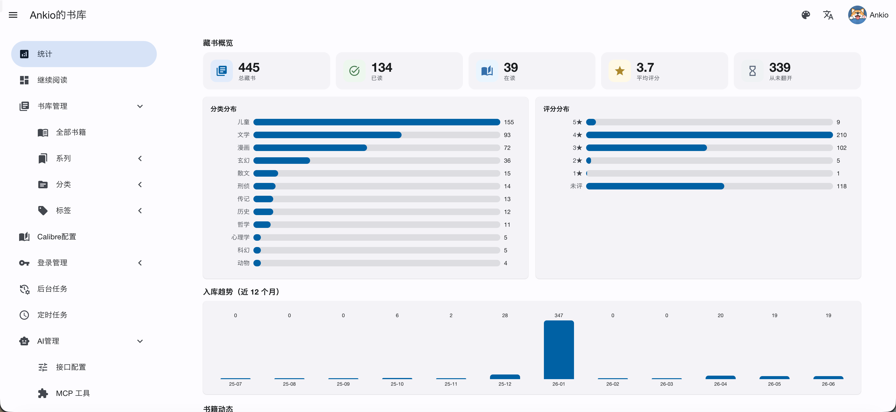
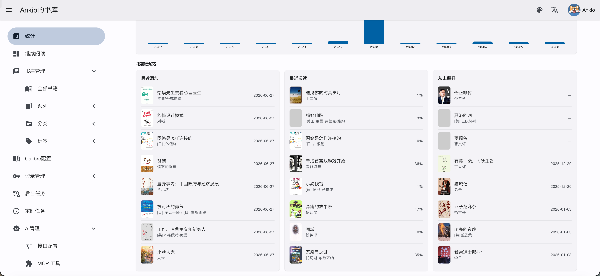
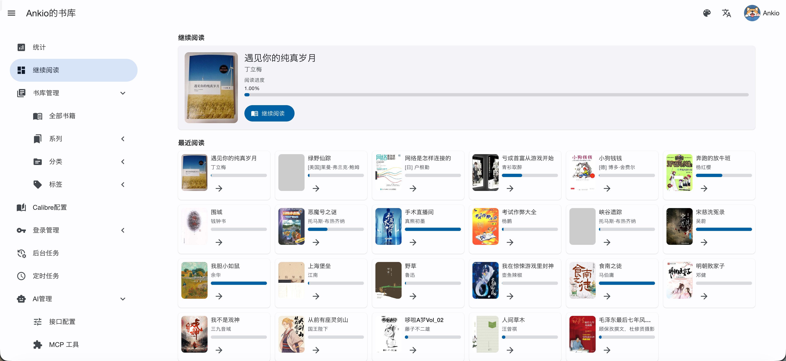
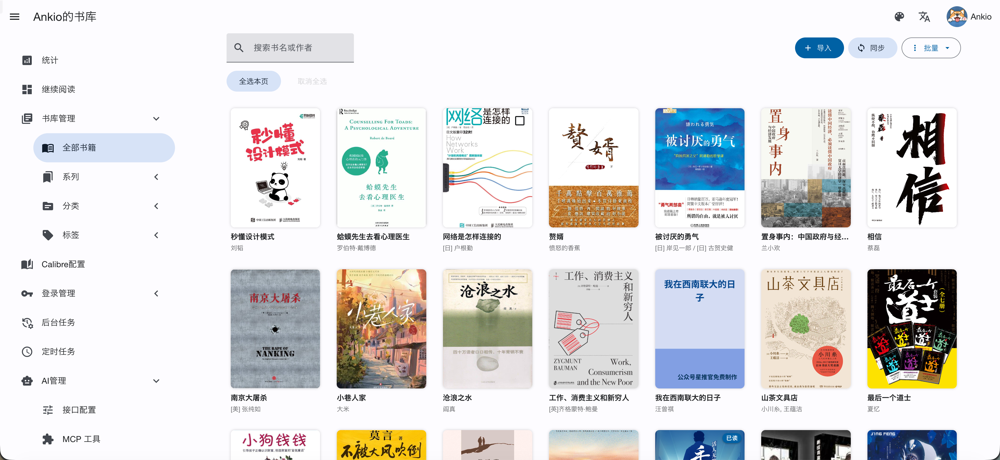
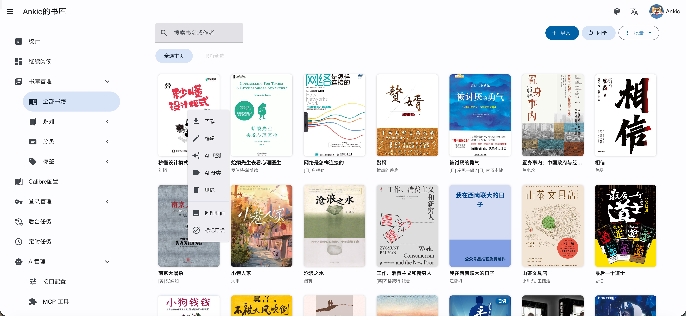
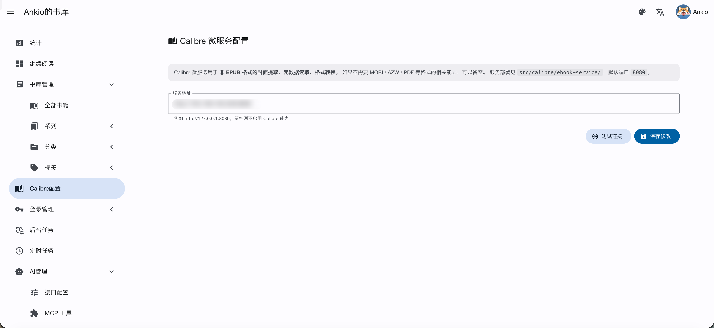
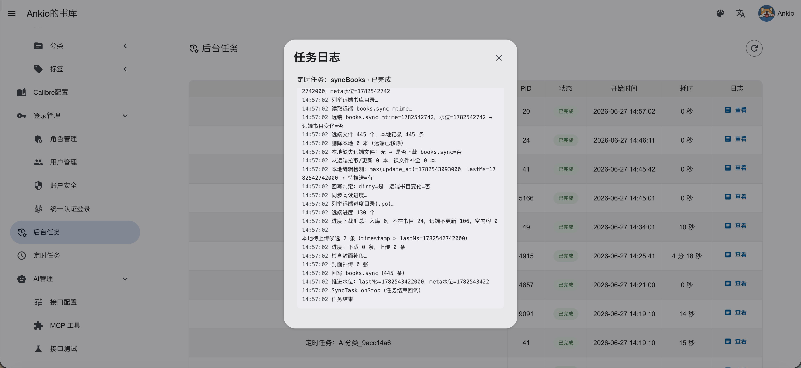
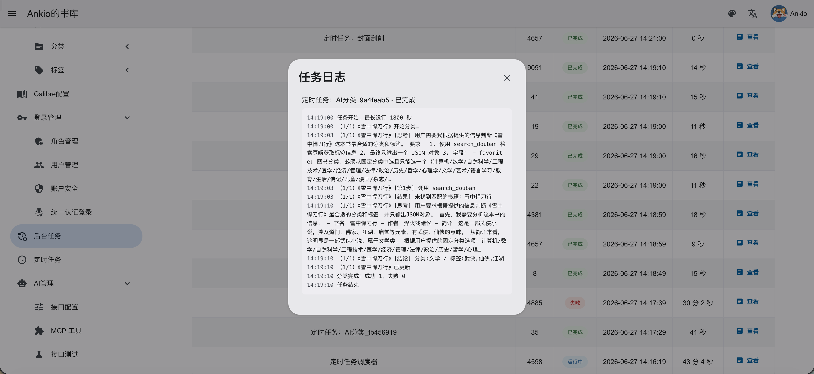

# Book 书籍管理系统

> **基于静读天下 App WebDAV 同步的 Web 端书库管理系统**

一个为 **静读天下（Moon+ Reader）** 用户设计的 PC 端书库管理后台：手机 App 通过 WebDAV 同步书籍和元数据，本系统在 Web 端提供搜索、批量编辑、豆瓣抓取、AI 智能识别、藏书统计、多维阅读统计、在线阅读等能力，并把改动同步回 WebDAV，形成双向闭环。

---

## 使用前必读

本系统**不是独立的书库管理系统**，必须配合静读天下 App + WebDAV 一起使用：

1. 在手机上安装静读天下（Moon+ Reader）
2. 配置一个可用的 WebDAV 服务（坚果云 / Nextcloud / 群晖 等）
3. 在静读天下中至少完成一次同步，让 WebDAV 上出现 `Apps/Books/` 目录
4. 在本系统的安装向导中填入**完全相同**的 WebDAV 凭据

没有静读天下生成的 WebDAV 数据，本系统是空的。

---

## 功能概览

- **WebDAV 双向同步**：与静读天下共享同一个书库，每小时自动增量同步，也可手动触发
- **元数据管理**：分类、标签、收藏、系列（带编号）、5 星评分、已读状态
- **AI 智能识别**：接入 OpenRouter / ChatGPT 等 LLM，自动检索豆瓣补全书名、作者、简介、封面、评分、分类、标签
- **AI 智能分类**：批量让 AI 根据书籍信息自动判断分类和标签
- **豆瓣搜索**：手动搜索豆瓣，获取书名、作者、简介、封面、出版信息
- **微信读书搜索**：编辑页可从微信读书补全书籍元数据；AI 识别也可调用微信读书源（豆瓣优先）
- **统计面板**：藏书总量、已读/在读/未读、分类分布、评分分布、近 12 月入库趋势
- **多维阅读统计**：总时长 / 近 7 天 / 最长单日、月度与星期分布、阅读日历；支持静读天下 `.mrpro` 备份导入、手动/批量补录、改绑书库与删除；数据也可由 [KOReader Book 插件](https://github.com/AnkioTomas/moon) 上报
- **批量操作**：批量改分类 / 标签 / 系列、批量已读标记、批量删除、批量封面刮削、删除重复
- **Web 端上传**：拖拽 / 多选，大文件分片，支持 EPUB / MOBI / AZW / AZW3 / PDF / TXT，上传后自动入库并发布到 WebDAV
- **在线阅读器**（Foliate.js）：支持 EPUB / MOBI / AZW / AZW3 / PDF
- **阅读进度同步**：与静读天下共享同一份进度文件，双向 last-write-wins 仲裁
- **设备令牌 / Book API**：长期 Bearer Token，供 [KOReader 插件（moon）](https://github.com/AnkioTomas/moon) 或其它第三方客户端调用书库接口（不直连 WebDAV）
- **Web 安装向导**：首次部署通过浏览器填表完成配置，无需手动编辑配置文件

---

## 界面预览

<p align="center">
  <br/>
  <br/>
  <sub><b>统计面板</b> — 藏书概览、分类分布、评分分布、入库趋势、最近添加 / 最近阅读 / 从未翻开</sub>
</p>

<p align="center">
  <br/>
  <sub><b>继续阅读</b> — 当前阅读进度卡片 + 最近阅读书籍网格</sub>
</p>

<p align="center">
  <br/>
  <sub><b>书库管理</b> — 封面卡片视图，搜索、导入、同步、批量操作</sub>
</p>

<p align="center">
  <br/>
  <sub><b>右键菜单</b> — 下载、编辑、AI 识别、AI 分类、删除、刮削封面、标记已读</sub>
</p>

<p align="center">
  <br/>
  <sub><b>分类筛选</b> — 按分类 / 系列 / 标签分组浏览</sub>
</p>

<p align="center">
  <br/>
  <sub><b>Calibre 配置</b> — 微服务地址设置与连接测试</sub>
</p>

<p align="center">
  <br/>
  <sub><b>后台任务</b> — WebDAV 同步日志，增量同步全过程可追溯</sub>
</p>

<p align="center">
  <br/>
  <sub><b>AI 分类</b> — 后台任务日志，AI 自动检索豆瓣并写入分类和标签</sub>
</p>

---

## 系统要求

| 组件 | 版本 / 说明 |
| --- | --- |
| PHP | >= 8.3，需要 `mbstring`、`pdo`、`curl`、`gd`、`zip`、`fileinfo`；MySQL 部署另需 `pdo_mysql`，SQLite 部署另需 `pdo_sqlite` |
| 数据库 | **SQLite**（Docker / Windows 绿色包默认）或 **MySQL >= 5.7 / MariaDB >= 10.2**（`utf8mb4`） |
| Web 服务器 | Nginx 或 Apache（必须支持 URL 重写）；Docker 包用内置 Workerman，Windows 绿色包自带 Nginx |
| WebDAV | 坚果云 / Nextcloud / 群晖 / 阿里云盘网关，任选其一 |
| 静读天下 App | Android，支持 WebDAV 同步的版本即可 |
| Docker（可选） | 整站 Docker 部署，或仅跑 Calibre `ebook-service` 做 MOBI/AZW 封面提取 |

---

## 发布包说明

`dist/`（或 GitHub Release）提供三种包，**按场景选一个**：

| 包名 | 场景 | 说明 |
| --- | --- | --- |
| `book-<版本>-windows.zip` | Windows 本机开箱即用 | 内置 PHP 8.3 + Nginx（TinyPHP），双击 `start.bat` → `http://localhost` |
| `book-<版本>-docker.zip` | 已有 Docker | 含 `Dockerfile` + `compose`，`docker compose up -d` → `http://localhost:9528` |
| `book-<版本>.zip` | 已有 LNMP / 面板 | 标准 PHP 源码，配合 1Panel / 宝塔 / phpEnv 等 |

Docker / Windows 绿色包默认走 **SQLite**，不必另装 MySQL。标准包可按安装向导选 SQLite 或 MySQL。

---

## 部署教程

| 环境 | 文档 | 说明 |
| --- | --- | --- |
| Windows 绿色包 | [Windows 绿色包教程](docs/install-windows.md) | 下载 `book-*-windows.zip`，解压后双击 `start.bat` |
| Docker | [Docker 安装教程](docs/install-docker.md) | 下载 `book-*-docker.zip`，`docker compose up -d` |
| Windows + phpEnv | [phpEnv 安装教程](docs/install-phpenv.md) | 从 [phpenv.cn](https://www.phpenv.cn/download.html) 自建环境，可用标准 zip |
| Linux 服务器 | [1Panel 安装教程](docs/install-1panel.md) | 通过 1Panel 创建 PHP 运行环境与网站 |
| Linux 服务器 | [宝塔面板安装教程](docs/install-baota.md) | 通过宝塔面板部署 LNMP 与网站 |

下面「通用安装步骤」适用于 **标准 zip / 源码** 且 **已具备 PHP 8.3 + 数据库 + Nginx/Apache** 的环境。绿色包与 Docker 包请直接看对应文档，不必走 Git 拉代码流程。

---

## 部署形态

### 必需（标准部署）

| 服务 | 用途 |
| --- | --- |
| SQLite 或 MySQL / MariaDB | 业务数据库 |
| PHP >= 8.3 | 运行后端 |
| Nginx / Apache | Web 服务器，需 URL 重写 |

> Windows 绿色包 / Docker 包已自带运行时，按对应教程启动即可。

### 可选

- **`ebook-service` 容器**：位于 `src/calibre/ebook-service/`，封装 Calibre CLI 提供 HTTP 接口，用于：
  - MOBI / AZW / AZW3 等非 EPUB 格式的封面提取
  - 格式转换（如需要）

  启动方式：

  ```bash
  cd src/calibre/ebook-service
  docker compose up -d
  ```

  服务监听 `8080` 端口，安装完成后可在系统「Calibre 配置」页面填入地址并测试连接。

  不需要 Calibre 能力时，**这个容器可以完全不装**，系统只会失去非 EPUB 格式的封面提取功能。

---

## 通用安装步骤

> Windows 绿色包 / Docker 包请直接看对应文档。以下针对 **标准 zip** 或 **Git 源码**。

### 1. 获取代码

**方式 A：标准发布包（推荐）**

下载 `book-<版本>.zip`，解压到网站目录。包内即 `src/` 内容（已含 submodule），无需再 `git submodule`。

**方式 B：Git**

```bash
git clone <repository-url> book
cd book
git submodule update --init --recursive
```

### 2. 准备数据库

- **SQLite（默认）**：无需预建库，安装向导会自动生成。
- **MySQL / MariaDB**：事先建空库 + 账号：

```sql
CREATE DATABASE `book` DEFAULT CHARACTER SET utf8mb4 COLLATE utf8mb4_unicode_ci;
CREATE USER 'book'@'%' IDENTIFIED BY '改成你自己的强密码';
GRANT ALL PRIVILEGES ON `book`.* TO 'book'@'%';
FLUSH PRIVILEGES;
```

> 不需要手工建表，系统首次启动会自动建表并升级 schema。

### 3. 准备配置文件

Git 源码需复制模板；标准 zip 解压后同样有 `example.config.php`：

```bash
cp src/example.config.php src/config.php
```

> 标准 zip 解压后若目录即应用根（无外层 `src/`），则：`cp example.config.php config.php`。  
> `config.php` 已被 `.gitignore` 排除。后续配置由安装向导自动写入。

### 4. 配置 Nginx

工作目录指向 `src/public`，并加 URL 重写：

```nginx
server {
    listen 80;
    server_name your-domain.com;
    root /path/to/book/src/public;
    index index.php;

    location / {
        rewrite ^(.*)$ /index.php/$1 last;
    }

    location ~ \.php(/|$) {
        fastcgi_split_path_info ^(.+\.php)(/.*)$;
        fastcgi_pass   127.0.0.1:9000;   # 容器化部署改成 php-fpm:9000
        fastcgi_index  index.php;
        include        fastcgi_params;
        fastcgi_param  SCRIPT_FILENAME $document_root$fastcgi_script_name;
        fastcgi_param  PATH_INFO       $fastcgi_path_info;
    }
}
```

确保 `src/runtime` 目录对 PHP 进程可写（缓存、日志、初始密码都写这里）。

### 5. 运行安装向导

打开 `http://your-domain.com`，系统检测到未安装会自动跳转到安装页面。

在安装向导中填写：

- **数据库类型**：SQLite（默认）或 MySQL / MariaDB
- **数据库连接**：选 MySQL 时填主机、端口、账号、密码、库名；选 SQLite 时可忽略主机账号
- **WebDAV 配置**：服务器地址、账号、密码、设备 ID
- **系统名称**：显示在页面标题的名称

提交后系统会：

1. 测试数据库连接
2. 写入配置到 `config.php`
3. 自动建表并生成管理员账号
4. 返回初始管理员用户名和密码

用返回的凭据登录即可。

> 三个最常见的 WebDAV 配错：
> - 地址少了末尾 `/dav/`
> - 坚果云填了登录密码而不是"应用密码"
> - App 端和本系统的地址 / 账号不一致

---

## 用户名密码

本系统**没有注册页**，管理员账号在安装时自动生成：

- 用户名固定：`admin`
- 密码：随机 16 位十六进制串，安装完成后会显示在页面上，同时写入 `src/runtime/admin_password.txt`

登录后立刻去**右上角用户菜单 → 修改密码**，把初始随机密码换成你自己的。限制：
- 新密码最少 8 位
- 新用户名只能是 5–10 位的小写字母数字
- 修改成功会强制踢下线，需要用新凭据重新登录

> 忘记密码的最快做法：直接 `DROP TABLE` 用户相关表让系统重新生成 admin，或者手动用 `password_hash()` 在 MySQL 里改 `password` 字段。

如果有自建 SSO（OIDC），在 `config.php` 中将 `login.ssoEnable` 改为 `true`，并填写 `ssoProviderUrl`、`ssoClientId`、`ssoClientSecret`。

---

## AI 功能配置（可选）

系统集成了 AI 能力，用于：

- **AI 智能填充**：编辑书籍时一键让 AI 检索豆瓣 / 微信读书，补全书名、作者、简介、封面、评分、分类、标签（SSE 实时推送进度，结果预填到表单供人工核对）
- **AI 批量识别**：选中多本书提交后台任务，AI 逐本检索并直接写库
- **AI 填充缺失**：仅补全空字段（作者、简介、分类、标签；封面空不算缺失），不覆盖已有内容；也可对侧栏「缺失详情」一键处理
- **AI 批量分类**：选中多本书提交后台任务，AI 自动判断分类和标签
- **上传后自动识别**（可选）：在「系统设置 → 书库」开启；配置键为 `book.autoFillOnUpload`（与 `ai` 服务商配置分离）

在 `config.php` 中配置 AI 服务商：

```php
'ai' => [
    'currentProvider' => 'OpenRouter',   // 或 'ChatGPT'
    'providers' => [
        'openrouter' => [
            'api_key'   => 'sk-or-v1-xxx',
            'api_url'   => 'https://openrouter.ai/api',
            'api_model' => 'qwen/qwen3.6-flash',
            'proxy'     => '',
        ],
        'chatgpt' => [
            'api_key'   => '',
            'api_url'   => '',
            'api_model' => '',
            'proxy'     => '',
        ],
    ],
],
```

不配置 AI 不影响系统其他功能，仅 AI 相关按钮不可用。

---

## 静读天下侧配置（一次就够）

打开静读天下 App → 设置 → 通过 WebDAV 同步：

```
服务器地址 : https://dav.jianguoyun.com/dav/    （以坚果云为例）
用户名     : your_email@example.com
密码       : 应用密码（不是登录密码）
同步文件夹 : Apps/Books/                        （保持默认，不要改）
勾选【同步我的书架】
```

在 App 侧执行一次「立即同步」，确认 WebDAV 上出现 `Apps/Books/` 目录后，再回到本系统等待自动同步或手动点击「同步」按钮拉数据。

---

## KOReader 插件与第三方 API

本系统除静读天下 WebDAV 同步外，还提供 **Bearer Token Book API**，给墨水屏 / 第三方客户端用，**不直连 WebDAV**。

官方 KOReader 插件仓库：[AnkioTomas/moon](https://github.com/AnkioTomas/moon)（`book.koplugin`）。

### 快速接入

1. 在本系统侧栏打开 **设备令牌**，创建令牌并**立即复制保存**（明文只显示一次）
2. 安装插件：把 `book.koplugin` 拷到 KOReader 的 `plugins/` 目录后重启
3. 打开 **Book 桌面 → 设置 → 服务器与令牌**，填写：
   - **服务器地址**：本服务基础 URL，例如 `https://book.example.com`
   - **令牌**：上一步复制的 `bk_…`
4. 点 **测试连接**；通过后即可浏览书库、下载打开、同步进度

其它客户端可按同样方式携带请求头：

```http
Authorization: Bearer bk_XXXXXXXX
```

常用接口示例（完整约定见 [moon 仓库 README](https://github.com/AnkioTomas/moon)）：

| 方法 | 路径 | 用途 |
| --- | --- | --- |
| `GET` | `/index/auth/ping` | 探测令牌 |
| `GET` | `/index/book/list` | 分页书库 |
| `GET` | `/index/book/recent` | 最近阅读 |
| `GET` | `/index/book/stats` | 总数 / 已读 / 未读 |
| `GET` | `/index/book/file?filename=` | 下载书籍 |
| `GET` | `/webdav/{filename}` | 封面 |
| `GET` / `POST` | `/index/book/progress` · `progressUpdate` | 读 / 写进度 |

成功响应与现有 Web API 一致：`{"code":200,"msg":"success","data":…}`。

### 阅读统计上报（可选）

侧栏 **多维统计**（`/index/main/insight`）展示阅读时长 KPI、日历与书籍列表。数据写入 `pagestat`，来源可以是：

1. **KOReader Book 插件**：按页停留上报（`POST /index/stats/import` 等，需设备令牌）
2. **静读天下备份**：页面右上角导入 `.mrpro`（`POST /index/stats/importMoon`）
3. **手动补录**：单日或按日期范围批量随机时长（`POST /index/stats/create` / `createBatch`）

同书同日多设备会按设备取 max 再汇总，避免重复导入把时长加两遍。未匹配到书库的记录可在表格中筛选、改绑或删除。

| 方法 | 路径 | 用途 |
| --- | --- | --- |
| `POST` | `/index/stats/device` | 注册/校验设备（兼容） |
| `POST` | `/index/stats/import` | KOReader 批量上报页停留 |
| `POST` | `/index/stats/importMoon` | 上传 `.mrpro` 备份 |
| `GET` | `/index/stats/insight` | 多维统计页数据 |
| `GET` | `/index/stats/books` | 阅读书籍列表（表格） |
| `POST` | `/index/stats/create` | 手动新建单日记录 |
| `POST` | `/index/stats/createBatch` | 按日期范围批量补录 |
| `POST` | `/index/stats/remap` | 阅读记录改绑到书库书籍 |
| `POST` | `/index/stats/removeBook` | 删除某书全部阅读记录 |

---

## 典型工作流

```
手机静读天下 → 加书 / 改元数据 → 同步到 WebDAV
                                      │
                                      ▼
                      本系统自动同步（每小时）或手动触发
                                      │
                                      ▼
              Web 端搜索 / 批量编辑 / AI 识别 / 豆瓣抓取 / 藏书统计 / 多维阅读统计
                                      │
                                      ▼
                         手机静读天下下次同步拉走更新

阅读时长数据另线进入「多维统计」：KOReader 上报，或导入静读天下 `.mrpro`，或 Web 端手动/批量补录。
```

---

## 故障排查

**同步后没有任何书：**
- 确认手机端真的成功同步了（WebDAV 上有 `Apps/Books/<书名>.epub`）
- 用 curl 验证 WebDAV 凭据：`curl -u "user:pass" https://dav.jianguoyun.com/dav/Apps/Books/`
- 检查 `src/runtime/log/` 下的错误日志

**登录页一直报错：**
- 验证码识别有误，刷新一下
- 查看 `src/runtime/log/` 是否记录了密码错误 / 验证码错误

**封面提取失败：**
- 非 EPUB 格式需要 `ebook-service` 容器
- 在系统「Calibre 配置」页面测试连接

**AI 功能不工作：**
- 确认 `config.php` 中 `ai.currentProvider` 和对应的 `api_key`、`api_url`、`api_model` 都已填写
- 检查网络是否能访问 AI 服务商的 API 地址

**数据库连不上：**
- 优先确认安装向导选的是 SQLite 还是 MySQL
- MySQL 主机名以面板/环境显示为准（phpEnv 本机常用 `127.0.0.1`；1Panel 容器化 MySQL 可能是 `mysql` 或 `127.0.0.1`）
- 确认账号有 `book` 库的全部权限

---

## 目录结构

```
book/
├── src/
│   ├── app/
│   │   ├── ai/                 # AI Agent、工具集、任务（元数据填充、分类）
│   │   ├── controller/         # 控制器（书籍、上传、豆瓣、Calibre、阅读统计）
│   │   ├── database/           # 数据模型与 DAO（Book、ReadingProgress、PageStat）
│   │   ├── task/               # 后台任务（同步、封面刮削、AI 识别/分类）
│   │   ├── utils/              # 工具类（豆瓣、BookManager、ReadingStats、MoonReaderImport、安装向导）
│   │   ├── static/             # 前端资源（JS、Foliate 阅读器、UI 组件）
│   │   └── Application.php     # 应用入口，路由注册，定时任务注册
│   ├── calibre/
│   │   └── ebook-service/      # 可选 Calibre 微服务（docker compose）
│   ├── nova/                   # Nova 框架 + 插件（submodule）
│   ├── public/                 # Web 入口，Nginx root 指向这里
│   ├── runtime/                # 缓存、日志、admin_password.txt
│   ├── example.config.php      # 配置模板，复制为 config.php 使用
│   └── config.php              # 实际配置（.gitignore 排除）
├── tests/                      # 测试目录
├── dist/                       # 发布包：标准 zip / docker zip / windows zip
├── docs/                       # 部署文档与截图
├── Dockerfile                  # Docker 整站镜像（Workerman :9528）
├── docker-compose.yml
├── nginx.conf                  # Nginx rewrite 参考
├── package.json                # 项目元信息
├── nova.phar                   # CLI 工具
└── README.md
```

---

## 技术栈

- **后端**：PHP 8.3 + Nova 框架 + SQLite / MySQL
- **前端**：MDUI 2.x + Foliate.js（在线阅读器）
- **AI**：OpenRouter / ChatGPT（通过 nova-ai 插件，Agent + Tool Calling 架构）
- **存储**：WebDAV（坚果云 / Nextcloud / 群晖 ……）
- **可选**：Calibre（封装在 `ebook-service` Python 微服务里）

---

## 许可证

MIT License

## 贡献

欢迎 Issue / PR：
- PHP：PSR-12 / `php-cs-fixer.dist.php`
- JS：ES6+
- Commit：写清楚"为什么改"，不只是"改了什么"
